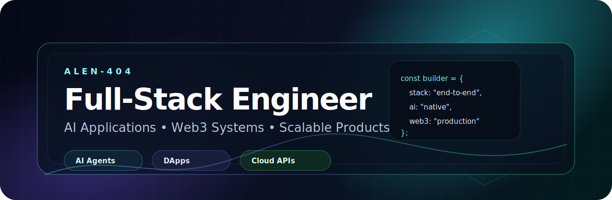

<h1 align="center">Alen</h1>

<p align="center">
  <strong>Full-Stack Engineer | AI Application Builder | Web3 Developer</strong>
</p>

<p align="center">
  I build production-ready software across modern web, backend systems, AI-native products, and blockchain applications.
</p>

---

## About Me

I am a full-stack engineer with a product-driven mindset and the ability to move across the entire software lifecycle: from architecture and UI engineering to backend services, databases, DevOps, AI workflows, and Web3 systems.

My strength is not limited to one framework or one stack. I work as a technology-agnostic builder who can quickly understand a product goal, choose the right tools, and ship practical, scalable solutions.

```typescript
const alen = {
  role: "Full-Stack Engineer",
  focus: [
    "AI Applications",
    "Web3 Systems",
    "SaaS Products",
    "Automation Platforms",
    "End-to-End Product Delivery",
  ],
  frontend: ["React", "Vue", "Next.js", "TypeScript", "Tailwind CSS"],
  backend: ["Node.js", "Python", "Go", "Java", "REST APIs", "GraphQL"],
  ai: ["LLM Applications", "AI Agents", "RAG", "Prompt Engineering", "Workflow Automation"],
  web3: ["Solidity", "EVM", "Smart Contracts", "DApps", "On-chain Data"],
  data: ["PostgreSQL", "MySQL", "MongoDB", "Redis"],
  cloud: ["Docker", "Linux", "CI/CD", "API Security", "Scalable Architecture"],
  mindset: ["Own the stack", "Ship fast", "Build for users", "Design systems that last"],
};
```

## What I Build

- Full-stack web applications with clean architecture and polished user experience.
- AI-powered products that turn models, agents, and automation into real user value.
- Web3 applications, smart contracts, wallet flows, and on-chain data integrations.
- Backend platforms, APIs, databases, dashboards, and internal business systems.
- Production-oriented systems with security, maintainability, and scalability in mind.

## Engineering Philosophy

I care about building software that is useful, reliable, and easy to evolve. I enjoy working close to the product, understanding the business goal, and turning complex technical ideas into systems that people can actually use.

---

## GitHub Stats


